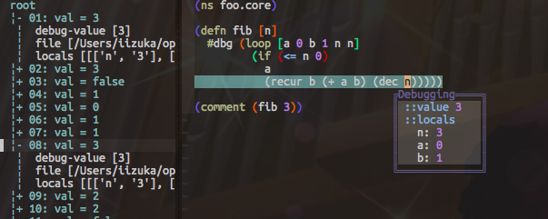
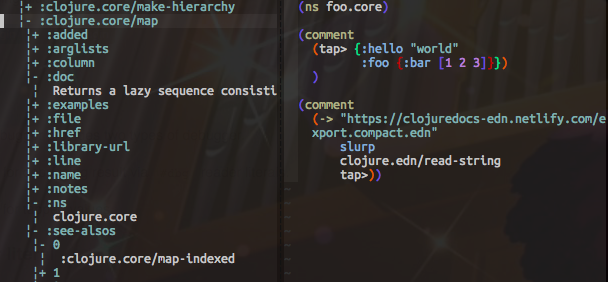

= vim-iced-fern-debugger

https://github.com/liquidz/vim-iced[vim-iced] debugging plugin powered by https://github.com/lambdalisue/fern.vim[fern.vim].

image:https://img.shields.io/badge/vim--iced-plugin-blue.svg?logo=data:image/svg+xml;base64,PHN2ZyB4bWxucz0iaHR0cDovL3d3dy53My5vcmcvMjAwMC9zdmciCiAgICAgeG1sbnM6eGxpbms9Imh0dHA6Ly93d3cudzMub3JnLzE5OTkveGxpbmsiCiAgICAgd2lkdGg9IjIwMCIgaGVpZ2h0PSIyMDAiCiAgICAgdmlld0JveD0iMTAsMTAsODAsODAiPgogIDxwb2x5Z29uIGZpbGw9IiNCM0U1RkMiIHBvaW50cz0iNTAsMTAgMTAsNTAgMzAsNzAgMjAsNTAiLz4KICA8cG9seWdvbiBmaWxsPSIjOTBDQUY5IiBwb2ludHM9IjUwLDEwIDMwLDUwIDMwLDcwIDU1LDUwIi8+CiAgPHBvbHlnb24gZmlsbD0iIzgxRDRGQSIgcG9pbnRzPSI1MCwxMCA3MCw3MCA5MCw1MCIvPgogIDxwb2x5Z29uIGZpbGw9IiM2NEI1RjYiIHBvaW50cz0iNjAsNjAgMzAsNzAgNTAsOTAgNzAsNzAiLz4KPC9zdmc+Cg==["vim-iced plugin", link="https://github.com/liquidz/vim-iced"]
image:https://img.shields.io/badge/🌿%20fern-plugin-yellowgreen["fern plugin", link="https://github.com/lambdalisue/fern.vim"]

== Usage

vim-iced-fern-debugger provides two types of debugger.

* Tree view for debugging result via `#dbg` reader literals.
* Tree view for tapped values.

=== #dbg reader literal

Execute `:IcedToggleFernDebugger` to toggle vim-iced's debugger.
To launch debugger, please see the following document.
https://liquidz.github.io/vim-iced/#debugging

If you'd like to use vim-iced-fern-debugger always, please set `"fern"` to `g:iced#debug#debugger`.
[source,vim]
----
let g:iced#debug#debugger = 'fern'
----

=== Tapped values

This plugin provides following commands.

|===
|Command | Note

| `:IcedBrowseTappedFern`
| Browse all tapped values

| `IcedBrowseLastTappedFern`
| Browse the last tapped value

|===

== Requirements

* https://github.com/liquidz/vim-iced[vim-iced] (`0.14.2` or later)
* https://github.com/lambdalisue/fern.vim[fern.vim]

== Installation

=== vim-plug

[source,vim]
----
Plug 'lambdalisue/fern.vim'
Plug 'liquidz/vim-iced', {'for': 'clojure'}
Plug 'liquidz/vim-iced-fern-debugger', {'for': 'clojure'}
----

Execute `:PlugInstall` to install above plugins.

== License

Copyright (c) 2020 http://twitter.com/uochan[Masashi Iizuka].

Distributed under the MIT License.
